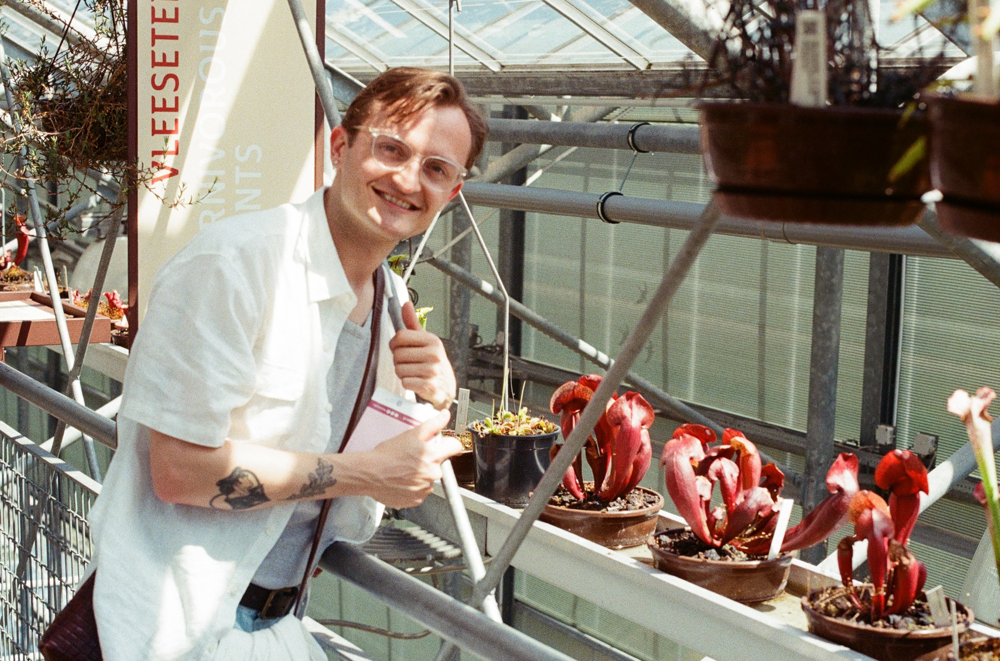

  

  

    <h1> James Stannah, PhD</h1>
    <h2> Postdoctoral Researcher, Factor-Inwentash Faculty of Social Work (FIFSW), University of Toronto (UofT) </h2>

    

    I’m James Stannah. I'm a <u>social epidemiologist</u> with a focus on HIV and other sexually transmitted and bloodborne infection (STBBI) prevention, treatment, and care and sexual health and wellbeing among marginalised populations, in particular LGBTQIA+ people and women and girls. My research has explored how we can better quantify the impacts of social and structural factors, like stigma, discrimination, violence, and criminalisation, on health and wellbeing outcomes and access to essential HIV/STI services in settings in the Global North and South. Recently, through a postdoc with the <a href="https://sshinelab.com/">SSHINE Lab</a> at UofT led by Dr. Carmen Logie, I was coordinating and analysing primary research exploring the impacts of climate-related extreme weather on resource insecurity and sexual and reproductive health outcomes among gbMSM and AGYW in Kenya. Increasingly, I am interested in understanding how we can make quantitative estimates of structural determinants that are useful for developing interventions and guiding policy decisions (e.g., in collaboration with mathematical modellers) and how we can better integrate qualitative insights through mixed-methods research to improve quanitative inference.
    

    

## Research Interests
- Social and structural determinants of sexual health & wellbeing and HIV/STBBI outcomes
- LGBTQIA+ and women’s health 
- Quantitative and mixed-methods research
- Improving HIV prevention and care outcomes and access
- Community-based research

## Highlights
- Publications in leading journals (see [Publications](/publications/))  
- Collaborations with UNAIDS and international partners
- Presenter at global health and epidemiology conferences
- Successful grant applications
- Study coordination and survey design
